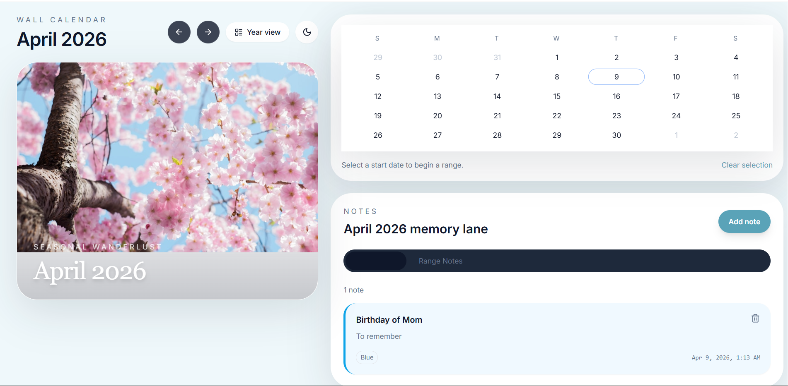

# Wall Calendar Component

A polished, interactive wall calendar built with Next.js 14, TypeScript, Tailwind CSS, Framer Motion, Zustand, React Hook Form, and date-fns.



## Tech Stack & Rationale

- **Next.js 14 (App Router)**: Modern React framework with server-side rendering and optimized performance for production-grade apps
- **TypeScript**: Type safety and better developer experience with comprehensive type definitions
- **Tailwind CSS**: Utility-first CSS framework for rapid, consistent styling and responsive design
- **Framer Motion**: Declarative animations and transitions for smooth page flip effects and UI interactions
- **Zustand**: Lightweight state management for global calendar state (simpler than Redux for this use case)
- **React Hook Form**: Efficient form handling for notes with minimal re-renders
- **date-fns**: Modern date utility library (smaller bundle than Moment.js, tree-shakeable)
- **Lucide React**: Consistent, customizable icons with good accessibility support

## Features

### Core Functionality
- **Interactive Calendar Grid**: Click to select date ranges with visual feedback and hover previews
- **Page Flip Animation**: 3D CSS card flip transition between months with smooth easing
- **Seasonal Theming**: Auto-updating color palettes and hero images based on current month
- **Notes System**: Month-wide and range-specific notes with color coding and localStorage persistence
- **Holiday Indicators**: Visual dots for US federal holidays with tooltips
- **Keyboard Navigation**: Full accessibility with arrow key navigation and screen reader support

### Visual Polish
- **Ken Burns Effect**: Subtle pan/zoom animation on hero images
- **Paper Texture**: CSS noise filter for authentic wall calendar feel
- **Hanging Rings**: Physical calendar aesthetic with CSS circles
- **Spiral Binding**: Visual binding effect between panels on desktop
- **Glass Panels**: Backdrop blur effects for modern UI depth

### Responsive Design
- **Mobile**: Stacked layout with collapsible notes panel and touch-friendly interactions
- **Tablet**: 50/50 split with expandable drawer for notes
- **Desktop**: 40/60 split with always-visible notes sidebar and year overview strip

### Accessibility
- ARIA labels and roles for screen readers
- Keyboard navigation with focus management
- High contrast focus rings
- Semantic HTML structure
- Screen reader announcements for range selection

## Setup

```bash
npm install
npm run dev
```

Open [http://localhost:3000](http://localhost:3000) in your browser.

## Architecture Decisions

### State Management
- **Zustand** for global calendar state (current month, selection, theme) - chosen over Context API for simpler API and better performance with frequent updates
- **React Hook Form** for notes - handles form validation and submission efficiently
- **localStorage** for persistence - simple, no backend required, works offline

### Date Handling
- **date-fns** over Moment.js - smaller bundle size, modern API, tree-shakeable
- Custom utility functions for calendar grid generation and date range logic
- Normalized date objects to avoid timezone issues

### Styling Approach
- **CSS Custom Properties** for theming - allows runtime color updates with smooth transitions
- **Tailwind utilities** for layout and spacing - consistent design system
- **CSS animations** for complex effects like Ken Burns and page flips

### Component Structure
- **Memoized components** (DayCell) for performance with large grids
- **Custom hooks** for reusable logic (useCalendar, useRangeSelection, useNotes)
- **Separation of concerns** with dedicated folders for types, lib, hooks, store, and components

## Known Limitations

- Holiday data is static for 2025-2026 only
- Hero images are hardcoded URLs (would need dynamic loading in production)
- No backend integration (localStorage only)
- Limited to US holidays (could be extended with i18n)

## Future Improvements

- Add event/reminder system with notifications
- Implement drag-and-drop for range selection
- Add export functionality (PDF, calendar formats)
- Support for multiple calendars/themes
- Internationalization for holidays and locales
- Backend API for shared calendars and cloud sync

## License

MIT